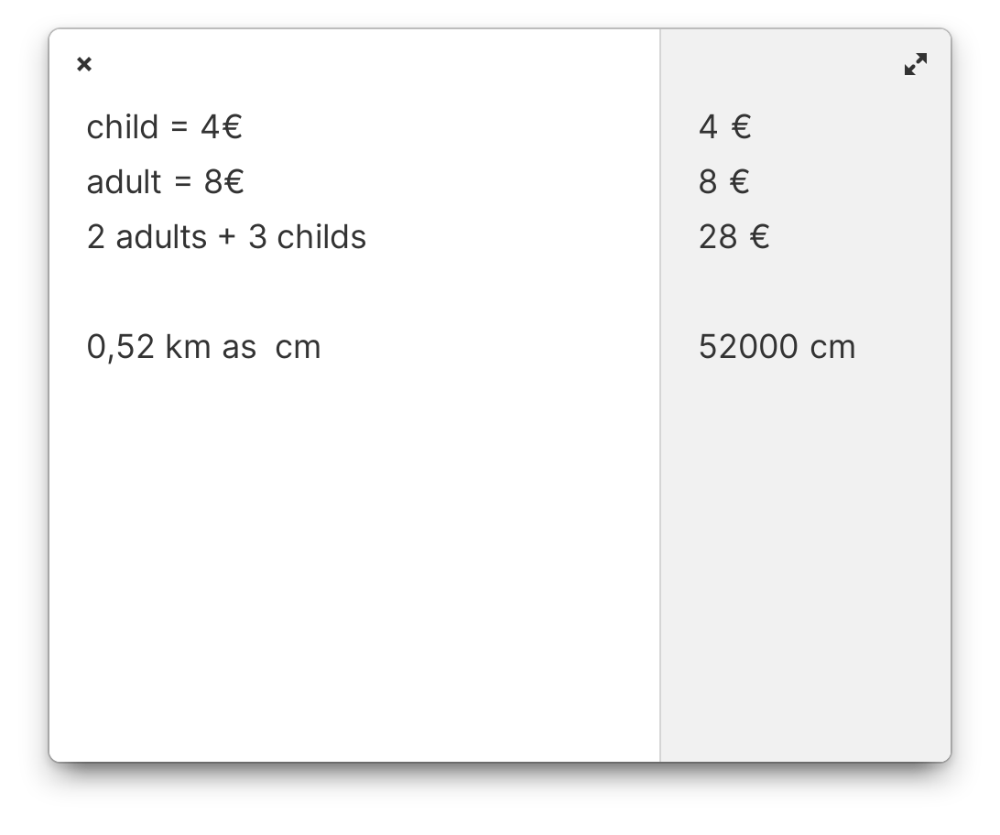

# Luca



A smart calculator app.

## Build

```bash
flatpak install -y appcenter io.elementary.Sdk
flatpak install runtime/org.freedesktop.Sdk.Extension.rust-stable/x86_64/23.08 --user -y
flatpak-builder --user flatpak_app pro.lasne.luca.json --force-clean --install
```

